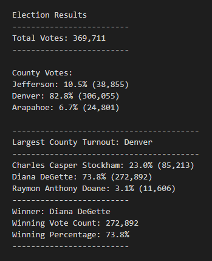

# Election-Analysis

## Overview of Project

The purpose of this election analysis project is to assist Colorado Board of Elections to complete the election aduit of the recent congressional election: 

- Total number of votes cast
- A complete list of candidates who received votes
- Total number of votes each candidate received
- Percentage of votes each candidate won
- The winner of the election based on popular vote

## Resources
- Data Sources: election_results.csv
- Software: Python 3.9.7, Visual Studio Code, 1.63.2

## Election Results

The analysis of this election has showed there are total of 369,711 votes and the breakdown is as follow: 

- Jefferon had total of 38,855 votes which was 10.5% of the total.
- Denver had total of 306,055 votes which was 82.8% of the total. 
- Arapahoe had total of 24,801 votes which was 6.7% of the total. 

Among the three counties, Denver had the largest number of votes 

In this election, there were three candidates and the total of votes they received are as follow: 

- Charles Casper Stockham received total of 85,213 votes which was 23.0% of the total. 
- Diana DeGette received total of 272,892 votes which was 73.8% of the total. 
- Raymon Anthony Doane received total of 11,606 votes which was 3.1% of the total. 

The winner of the election was Diana DeGette received total of 272,892 votes which was 73.8% of the total.

## Election-Audit Summary: 

Besides to determine the votes received for different counties and candidates, we can add the following variables for the future election: 

- Age
- Gender
- Voting Methods 
- Political affiliation

By adding these variables to the script, the election commission can understanding the population of their voters and which political parties receive higher votes. In addition, the variable of voting methods to help the commission and future candidates to better understand how they can encourage more citizens to vote and how can they better prepare during election campaign in the future elections. 
